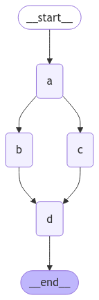

# Managing Recursion Depth in LangGraph

LangGraph enables advanced workflows but requires thoughtful control over recursion to prevent infinite loops or excessive depth. Here's how to configure and test recursion limits effectively.

## Setting Up a Graph

Begin by defining a graph with nodes representing tasks. For instance, create a simple computation graph:


```python
from langgraph.graph import StateGraph, START, END
import operator
from typing import Annotated
from typing_extensions import TypedDict
```


```python
# define graph state
class State(TypedDict):
    # The operator.add reducer fn makes this append-only
    aggregate: Annotated[list, operator.add]
```


```python
# Define nodes
def node_a(state):
    return {"aggregate": ["I'm A"]}


def node_b(state):
    return {"aggregate": ["I'm B"]}


def node_c(state):
    return {"aggregate": ["I'm C"]}


def node_d(state):
    return {"aggregate": ["I'm A"]}
```


```python
graph = StateGraph(State)

# add nodes
builder = StateGraph(State)
builder.add_node("a", node_a)
builder.add_node("b", node_b)
builder.add_node("c", node_c)
builder.add_node("d", node_d)

# add edges
builder.add_edge(START, "a")
builder.add_edge("a", "b")
builder.add_edge("a", "c")
builder.add_edge("b", "d")
builder.add_edge("c", "d")
builder.add_edge("d", END)

graph = builder.compile()
```


```python
from IPython.display import Image, display

display(Image(graph.get_graph().draw_mermaid_png()))
```


    

    


## Controlling Recursion Depth

LangGraph allows a recursion limit to ensure workflows terminate properly. Set this limit when invoking the graph:


```python
from langgraph.errors import GraphRecursionError
```


```python
try:
    graph.invoke({"aggregate": []}, 
                 {"recursion_limit": 3})
except GraphRecursionError:
    print("Recursion Error")
```

    Recursion Error


## Testing Recursion Limits

Run the graph and observe its behavior:


```python
try:
    graph.invoke({"aggregate": []}, {"recursion_limit": 4})
except GraphRecursionError:
    print("Recursion Error")
```

    DONE


If the recursion exceeds the limit, LangGraph raises an error, preventing further execution.

## Adapting Limits for Use Cases

Customize the recursion limit based on your workflow needs. For instance, a depth-first search might require a higher limit, while a repeating loop benefits from stricter control.


