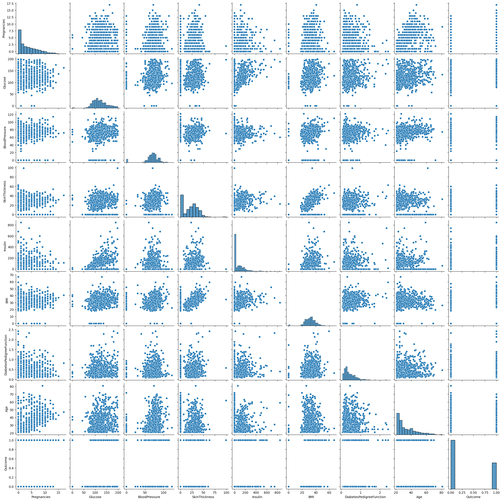
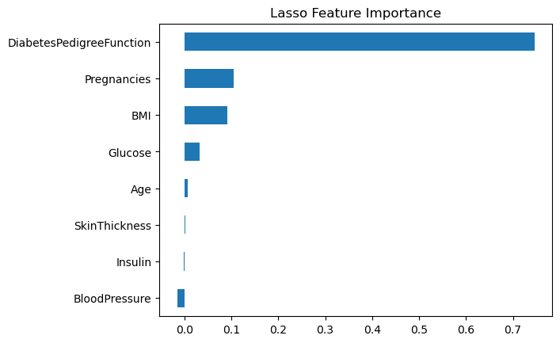
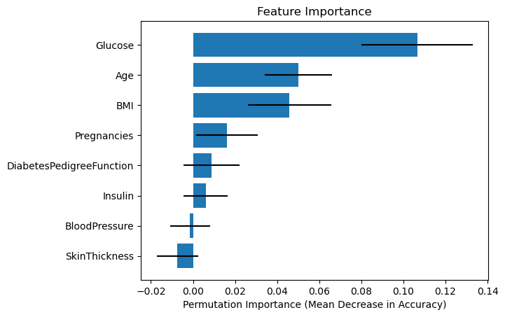
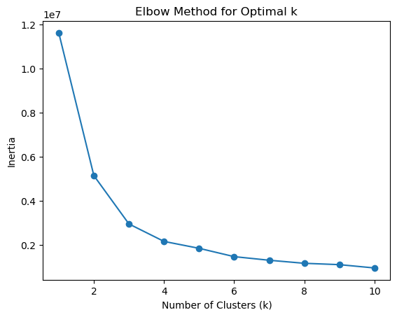
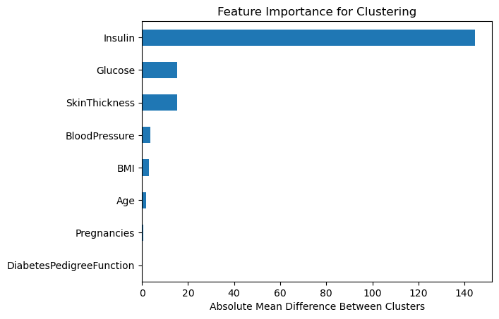

Examining a dataset with multiple variables with unclear relationships to a target variable. 


```python
import pandas as pd

PATH = "datasets/diabetes.csv"
```


```python
df = pd.read_csv(PATH)

print(f"{len(df):,} rows")
print(f"columns: {list(df.columns)}")
print(f"describe():")
display(df.describe().transpose())
```

    768 rows
    columns: ['Pregnancies', 'Glucose', 'BloodPressure', 'SkinThickness', 'Insulin', 'BMI', 'DiabetesPedigreeFunction', 'Age', 'Outcome']
    describe():


<div>
<style scoped>
    .dataframe tbody tr th:only-of-type {
        vertical-align: middle;
    }

    .dataframe tbody tr th {
        vertical-align: top;
    }

    .dataframe thead th {
        text-align: right;
    }
</style>
<table border="1" class="dataframe">
  <thead>
    <tr style="text-align: right;">
      <th></th>
      <th>count</th>
      <th>mean</th>
      <th>std</th>
      <th>min</th>
      <th>25%</th>
      <th>50%</th>
      <th>75%</th>
      <th>max</th>
    </tr>
  </thead>
  <tbody>
    <tr>
      <th>Pregnancies</th>
      <td>768.0</td>
      <td>3.845052</td>
      <td>3.369578</td>
      <td>0.000</td>
      <td>1.00000</td>
      <td>3.0000</td>
      <td>6.00000</td>
      <td>17.00</td>
    </tr>
    <tr>
      <th>Glucose</th>
      <td>768.0</td>
      <td>120.894531</td>
      <td>31.972618</td>
      <td>0.000</td>
      <td>99.00000</td>
      <td>117.0000</td>
      <td>140.25000</td>
      <td>199.00</td>
    </tr>
    <tr>
      <th>BloodPressure</th>
      <td>768.0</td>
      <td>69.105469</td>
      <td>19.355807</td>
      <td>0.000</td>
      <td>62.00000</td>
      <td>72.0000</td>
      <td>80.00000</td>
      <td>122.00</td>
    </tr>
    <tr>
      <th>SkinThickness</th>
      <td>768.0</td>
      <td>20.536458</td>
      <td>15.952218</td>
      <td>0.000</td>
      <td>0.00000</td>
      <td>23.0000</td>
      <td>32.00000</td>
      <td>99.00</td>
    </tr>
    <tr>
      <th>Insulin</th>
      <td>768.0</td>
      <td>79.799479</td>
      <td>115.244002</td>
      <td>0.000</td>
      <td>0.00000</td>
      <td>30.5000</td>
      <td>127.25000</td>
      <td>846.00</td>
    </tr>
    <tr>
      <th>BMI</th>
      <td>768.0</td>
      <td>31.992578</td>
      <td>7.884160</td>
      <td>0.000</td>
      <td>27.30000</td>
      <td>32.0000</td>
      <td>36.60000</td>
      <td>67.10</td>
    </tr>
    <tr>
      <th>DiabetesPedigreeFunction</th>
      <td>768.0</td>
      <td>0.471876</td>
      <td>0.331329</td>
      <td>0.078</td>
      <td>0.24375</td>
      <td>0.3725</td>
      <td>0.62625</td>
      <td>2.42</td>
    </tr>
    <tr>
      <th>Age</th>
      <td>768.0</td>
      <td>33.240885</td>
      <td>11.760232</td>
      <td>21.000</td>
      <td>24.00000</td>
      <td>29.0000</td>
      <td>41.00000</td>
      <td>81.00</td>
    </tr>
    <tr>
      <th>Outcome</th>
      <td>768.0</td>
      <td>0.348958</td>
      <td>0.476951</td>
      <td>0.000</td>
      <td>0.00000</td>
      <td>0.0000</td>
      <td>1.00000</td>
      <td>1.00</td>
    </tr>
  </tbody>
</table>
</div>


## Correlation analysis


```python
import seaborn as sns
import matplotlib.pyplot as plt
```

The simplest and most basic approach is to examine the correlation between the features and the target.


```python
display(df.corr()['Outcome'].sort_values(ascending=False))
```


    Outcome                     1.000000
    Glucose                     0.466581
    BMI                         0.292695
    Age                         0.238356
    Pregnancies                 0.221898
    DiabetesPedigreeFunction    0.173844
    Insulin                     0.130548
    SkinThickness               0.074752
    BloodPressure               0.065068
    Name: Outcome, dtype: float64


Visualizing all feature relationships can add understanding to the ways they interact. This helps develop an intuition about the dataset as a whole, not just the target.


```python
sns.pairplot(df)
```


    <seaborn.axisgrid.PairGrid at 0x146c84810>


    

    


## Random forest

Training a random forest and looking at feature importances to see which features contribute the most influence over the prediction. 

We are interested in extracting the maximum information from the trained model, not necessarily the accuracy of the trained model. As such, a train/test split will be used to gain understanding of how well the model performs but will ultimately not be used on the final model which will provide feature importances.

This process can be enhanced by performing the training multiple times and averaging the feature importances from each trained model.


```python
from sklearn.ensemble import RandomForestClassifier
from sklearn.model_selection import train_test_split
from sklearn.metrics import accuracy_score
```


```python
X_train, X_test, y_train, y_test = train_test_split(df.drop('Outcome', axis=1),
                                                    df['Outcome'],
                                                    test_size=0.2)
```


```python
rfc = RandomForestClassifier()
rfc.fit(X_train, y_train)

y_pred = rfc.predict(X_test)

accuracy = accuracy_score(y_test, y_pred)

print(f"Trained model:")
print(f"Training samples: {len(X_train)}; test samples: {len(X_test)}")
print(f"Model accuracy: {accuracy * 100.:.2f}%")
```

    Trained model:
    Training samples: 614; test samples: 154
    Model accuracy: 75.97%


```python
importances = []
for i in range(100):
    rfc = RandomForestClassifier()
    rfc.fit(df.drop('Outcome', axis=1), df['Outcome'])
    importances.append(
        {k: v for k, v in zip(df.drop('Outcome', axis=1).columns, rfc.feature_importances_)}
    )

print("Feature importances:")
print("-"*40)
display(pd.DataFrame(importances).mean())
```

    Feature importances:
    ----------------------------------------


    Pregnancies                 0.084139
    Glucose                     0.256652
    BloodPressure               0.089225
    SkinThickness               0.068620
    Insulin                     0.072823
    BMI                         0.165716
    DiabetesPedigreeFunction    0.125548
    Age                         0.137277
    dtype: float64


## Gradient boosting machines

We can use gradient boosting machines in the same way as a random forest. Gradient boosting machines often outperform random forests in accuracy so it is a worthy contributor to analysis.

As with random forest, we want to evaluate the accuracy of a trained model with a train/test split but we are ultimately more interested in the features importances. So the final training will be performed on the entire dataset multiple times and the importances will be averaged.


```python
from sklearn.ensemble import GradientBoostingClassifier
```


```python
X_train, X_test, y_train, y_test = train_test_split(df.drop('Outcome', axis=1),
                                                    df['Outcome'],
                                                    test_size=0.2)
```


```python
gbc = GradientBoostingClassifier()
gbc.fit(X_train, y_train)

y_pred = gbc.predict(X_test4

accuracy = accuracy_score(y_test, y_pred)

print(f"Trained model:")
print(f"Training samples: {len(X_train)}; test samples: {len(X_test)}")
print(f"Model accuracy: {accuracy * 100.:.2f}%")
```

    Trained model:
    Training samples: 614; test samples: 154
    Model accuracy: 76.62%


```python
importances = []
for i in range(100):
    gbc = GradientBoostingClassifier()
    gbc.fit(df.drop('Outcome', axis=1), df['Outcome'])
    importances.append(
        {k: v for k, v in zip(df.drop('Outcome', axis=1).columns, gbc.feature_importances_)}
    )

print("Feature importances:")
print("-"*40)
display(pd.DataFrame(importances).mean())
```

    Feature importances:
    ----------------------------------------


    Pregnancies                 0.051975
    Glucose                     0.409058
    BloodPressure               0.036877
    SkinThickness               0.017786
    Insulin                     0.047923
    BMI                         0.194155
    DiabetesPedigreeFunction    0.105170
    Age                         0.137057
    dtype: float64


## Linear regression with regularization

We can use a linear regression algorithm with regularization such as Lasso or logistic regression with l1 regularization which will perform feature selection, informing us which features are the most impactful on the target value.

_This does assume a linear relationship_


```python
from sklearn.linear_model import LogisticRegression
import matplotlib.pyplot as plt
```


```python
X_train, X_test, y_train, y_test = train_test_split(df.drop('Outcome', axis=1),
                                                    df['Outcome'],
                                                    test_size=0.2)
```


```python
ls = LogisticRegression(penalty='l1', solver='liblinear')
ls.fit(X_train, y_train)

y_pred = ls.predict(X_test)

accuracy = accuracy_score(y_pred, y_test)

print(f"Trained model:")
print(f"Training samples: {len(X_train)}; test samples: {len(X_test)}")
print(f"Model accuracy: {accuracy * 100.:.2f}%")
```

    Trained model:
    Training samples: 614; test samples: 154
    Model accuracy: 79.22%


```python
# get coefficients
coef = pd.Series(ls.coef_[0], index=X_train.columns)
print("Non-zero coefficients:")
print(coef[coef != 0])

# plot top features
coef[coef != 0].sort_values().plot(kind='barh')
plt.title('Lasso Feature Importance')
plt.show()
```

    Non-zero coefficients:
    Pregnancies                 0.104918
    Glucose                     0.032558
    BloodPressure              -0.015464
    SkinThickness               0.001977
    Insulin                    -0.001534
    BMI                         0.092203
    DiabetesPedigreeFunction    0.745402
    Age                         0.006794
    dtype: float64


    

    


## Permutation importance

This is the process of introducing variation to feature values to see how it impacts the performance of modeling.


```python
from sklearn.inspection import permutation_importance
```


```python
X_train, X_test, y_train, y_test = train_test_split(df.drop('Outcome', axis=1),
                                                    df['Outcome'],
                                                    test_size=0.2)
```


```python
rfc = RandomForestClassifier()
rfc.fit(X_train, y_train)

result = permutation_importance(
    rfc,
    X_test,
    y_test,
    n_repeats=100,
    scoring='accuracy',
    n_jobs=-1
)
```


```python
# display results
importance_df = pd.DataFrame({
    'Feature': X_train.columns,
    'Importance': result.importances_mean,
    'Std': result.importances_std
})
importance_df = importance_df.sort_values(by='Importance', ascending=False)
print(importance_df)

# plot
plt.barh(importance_df['Feature'], importance_df['Importance'], xerr=importance_df['Std'])
plt.xlabel('Permutation Importance (Mean Decrease in Accuracy)')
plt.title('Feature Importance')
plt.gca().invert_yaxis()
plt.show()
```

                        Feature  Importance       Std
    1                   Glucose    0.106494  0.026313
    7                       Age    0.050000  0.015972
    5                       BMI    0.045909  0.019680
    0               Pregnancies    0.016169  0.014650
    6  DiabetesPedigreeFunction    0.008701  0.013315
    4                   Insulin    0.005974  0.010618
    2             BloodPressure   -0.001364  0.009644
    3             SkinThickness   -0.007468  0.009821


    

    


## Clustering


```python
from sklearn.cluster import KMeans
```


```python
# find optimal number of clusters
inertias = []
k_range = range(1, 11)
for k in k_range:
    kmeans = KMeans(n_clusters=k)
    kmeans.fit(df.drop('Outcome', axis=1))
    inertias.append(kmeans.inertia_)

# plot
plt.plot(k_range, inertias, marker='o')
plt.xlabel('Number of Clusters (k)')
plt.ylabel('Inertia')
plt.title('Elbow Method for Optimal k')
plt.show()
```


    

    


```python
kmeans = KMeans(n_clusters=3)

df['Cluster'] = kmeans.fit_predict(df.drop('Outcome', axis=1))
cluster_result = pd.crosstab(df['Cluster'], df['Outcome'])

print("Cluster vs. Outcome:")
print('-'*20)
print(cluster_result)
```

    Cluster vs. Outcome:
    --------------------
    Outcome    0    1
    Cluster          
    0        347  148
    1        137   98
    2         16   22


```python
# group by cluster and calculate means
cluster_means = df.groupby('Cluster').mean().drop('Outcome', axis=1)
print("Feature Means by Cluster:")
display(cluster_means.transpose())

# calculate difference between clusters
feature_diff = (cluster_means.loc[0] - cluster_means.loc[1]).abs()
feature_diff = feature_diff.sort_values(ascending=False)
print("\nFeature Importance (Absolute Mean Difference):")
display(feature_diff)

# plot
feature_diff.plot(kind='barh')
plt.xlabel('Absolute Mean Difference Between Clusters')
plt.title('Feature Importance for Clustering')
plt.gca().invert_yaxis()
plt.show()
```

    Feature Means by Cluster:


<div>
<style scoped>
    .dataframe tbody tr th:only-of-type {
        vertical-align: middle;
    }

    .dataframe tbody tr th {
        vertical-align: top;
    }

    .dataframe thead th {
        text-align: right;
    }
</style>
<table border="1" class="dataframe">
  <thead>
    <tr style="text-align: right;">
      <th>Cluster</th>
      <th>0</th>
      <th>1</th>
      <th>2</th>
    </tr>
  </thead>
  <tbody>
    <tr>
      <th>Pregnancies</th>
      <td>3.981818</td>
      <td>3.527660</td>
      <td>4.026316</td>
    </tr>
    <tr>
      <th>Glucose</th>
      <td>114.008081</td>
      <td>129.327660</td>
      <td>158.447368</td>
    </tr>
    <tr>
      <th>BloodPressure</th>
      <td>67.771717</td>
      <td>71.446809</td>
      <td>72.000000</td>
    </tr>
    <tr>
      <th>SkinThickness</th>
      <td>14.997980</td>
      <td>30.306383</td>
      <td>32.263158</td>
    </tr>
    <tr>
      <th>Insulin</th>
      <td>14.400000</td>
      <td>159.102128</td>
      <td>441.289474</td>
    </tr>
    <tr>
      <th>BMI</th>
      <td>30.805455</td>
      <td>33.989362</td>
      <td>35.107895</td>
    </tr>
    <tr>
      <th>DiabetesPedigreeFunction</th>
      <td>0.431931</td>
      <td>0.540277</td>
      <td>0.569211</td>
    </tr>
    <tr>
      <th>Age</th>
      <td>33.759596</td>
      <td>31.902128</td>
      <td>34.763158</td>
    </tr>
  </tbody>
</table>
</div>


    
    Feature Importance (Absolute Mean Difference):


    Insulin                     144.702128
    Glucose                      15.319579
    SkinThickness                15.308403
    BloodPressure                 3.675091
    BMI                           3.183907
    Age                           1.857468
    Pregnancies                   0.454159
    DiabetesPedigreeFunction      0.108345
    dtype: float64


    

    