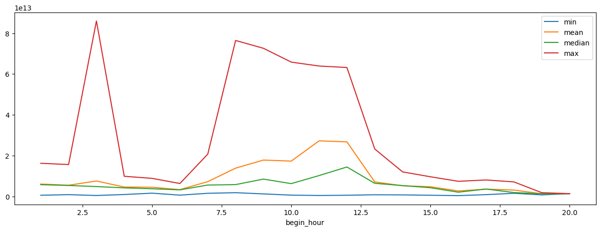
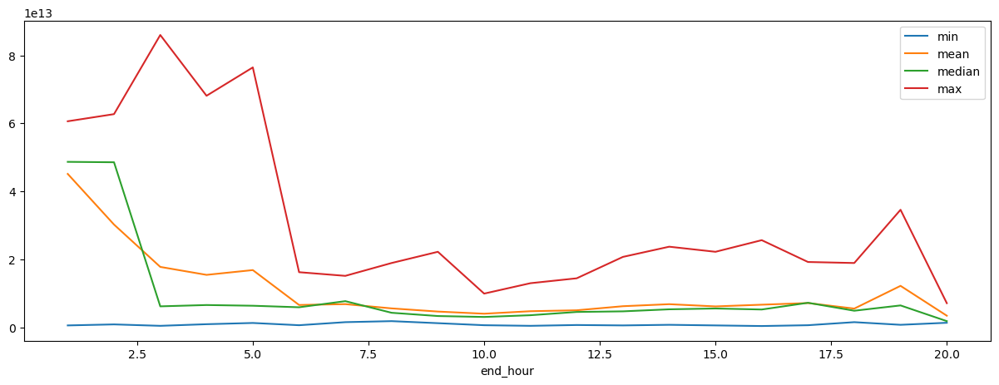
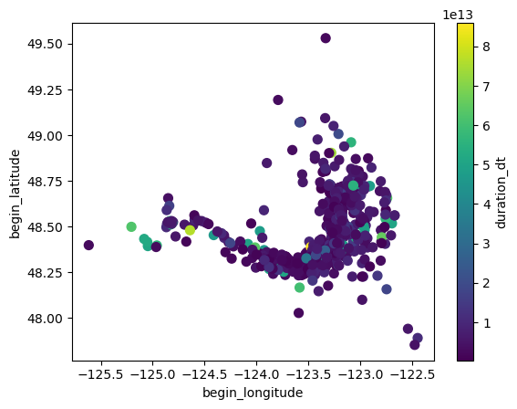
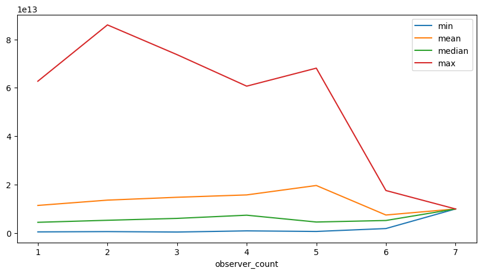

```python
import pandas as pd
import numpy as np
from IPython.display import display
import matplotlib.pyplot as plt
```

    Intel MKL WARNING: Support of Intel(R) Streaming SIMD Extensions 4.2 (Intel(R) SSE4.2) enabled only processors has been deprecated. Intel oneAPI Math Kernel Library 2025.0 will require Intel(R) Advanced Vector Extensions (Intel(R) AVX) instructions.
    Intel MKL WARNING: Support of Intel(R) Streaming SIMD Extensions 4.2 (Intel(R) SSE4.2) enabled only processors has been deprecated. Intel oneAPI Math Kernel Library 2025.0 will require Intel(R) Advanced Vector Extensions (Intel(R) AVX) instructions.


```python
df = pd.read_csv('datasets/orcas.csv')
```


```python
df.info()
```

    <class 'pandas.core.frame.DataFrame'>
    RangeIndex: 775 entries, 0 to 774
    Data columns (total 19 columns):
     #   Column              Non-Null Count  Dtype  
    ---  ------              --------------  -----  
     0   year                765 non-null    float64
     1   date                765 non-null    object 
     2   encounter_sequence  728 non-null    object 
     3   encounter_number    760 non-null    float64
     4   begin_time          753 non-null    object 
     5   end_time            754 non-null    object 
     6   duration            750 non-null    object 
     7   vessel              766 non-null    object 
     8   observers           767 non-null    object 
     9   pods_or_ecotype     767 non-null    object 
     10  ids_encountered     28 non-null     object 
     11  location            757 non-null    object 
     12  begin_latitude      729 non-null    float64
     13  begin_longitude     731 non-null    float64
     14  end_latitude        731 non-null    float64
     15  end_longitude       732 non-null    float64
     16  encounter_summary   761 non-null    object 
     17  nmfs_permit         639 non-null    object 
     18  link                775 non-null    object 
    dtypes: float64(6), object(13)
    memory usage: 115.2+ KB


```python
df.describe()
```


<div>
<style scoped>
    .dataframe tbody tr th:only-of-type {
        vertical-align: middle;
    }

    .dataframe tbody tr th {
        vertical-align: top;
    }

    .dataframe thead th {
        text-align: right;
    }
</style>
<table border="1" class="dataframe">
  <thead>
    <tr style="text-align: right;">
      <th></th>
      <th>year</th>
      <th>encounter_number</th>
      <th>begin_latitude</th>
      <th>begin_longitude</th>
      <th>end_latitude</th>
      <th>end_longitude</th>
    </tr>
  </thead>
  <tbody>
    <tr>
      <th>count</th>
      <td>765.000000</td>
      <td>760.000000</td>
      <td>729.000000</td>
      <td>731.000000</td>
      <td>731.000000</td>
      <td>732.000000</td>
    </tr>
    <tr>
      <th>mean</th>
      <td>2020.419608</td>
      <td>46.353947</td>
      <td>48.490465</td>
      <td>-123.354188</td>
      <td>48.500239</td>
      <td>-123.359250</td>
    </tr>
    <tr>
      <th>std</th>
      <td>2.308165</td>
      <td>29.681884</td>
      <td>0.181702</td>
      <td>0.427994</td>
      <td>0.189330</td>
      <td>0.445846</td>
    </tr>
    <tr>
      <th>min</th>
      <td>2017.000000</td>
      <td>1.000000</td>
      <td>47.853333</td>
      <td>-125.616669</td>
      <td>47.858418</td>
      <td>-125.623337</td>
    </tr>
    <tr>
      <th>25%</th>
      <td>2018.000000</td>
      <td>20.000000</td>
      <td>48.357666</td>
      <td>-123.438084</td>
      <td>48.359417</td>
      <td>-123.470665</td>
    </tr>
    <tr>
      <th>50%</th>
      <td>2020.000000</td>
      <td>44.000000</td>
      <td>48.476501</td>
      <td>-123.228668</td>
      <td>48.484333</td>
      <td>-123.224503</td>
    </tr>
    <tr>
      <th>75%</th>
      <td>2022.000000</td>
      <td>70.000000</td>
      <td>48.591110</td>
      <td>-123.135334</td>
      <td>48.621416</td>
      <td>-123.130165</td>
    </tr>
    <tr>
      <th>max</th>
      <td>2024.000000</td>
      <td>111.000000</td>
      <td>50.058334</td>
      <td>-122.444672</td>
      <td>50.044998</td>
      <td>-122.044502</td>
    </tr>
  </tbody>
</table>
</div>


## Analyzing encounter times and durations


```python
df[['begin_time', 'end_time', 'duration']].head()
```


<div>
<style scoped>
    .dataframe tbody tr th:only-of-type {
        vertical-align: middle;
    }

    .dataframe tbody tr th {
        vertical-align: top;
    }

    .dataframe thead th {
        text-align: right;
    }
</style>
<table border="1" class="dataframe">
  <thead>
    <tr style="text-align: right;">
      <th></th>
      <th>begin_time</th>
      <th>end_time</th>
      <th>duration</th>
    </tr>
  </thead>
  <tbody>
    <tr>
      <th>0</th>
      <td>10:48:00</td>
      <td>12:21:00</td>
      <td>5580s (~1.55 hours)</td>
    </tr>
    <tr>
      <th>1</th>
      <td>09:30:00</td>
      <td>10:11:00</td>
      <td>2460s (~41 minutes)</td>
    </tr>
    <tr>
      <th>2</th>
      <td>02:15:00</td>
      <td>05:00:00</td>
      <td>9900s (~2.75 hours)</td>
    </tr>
    <tr>
      <th>3</th>
      <td>10:34:00</td>
      <td>12:05:00</td>
      <td>5460s (~1.52 hours)</td>
    </tr>
    <tr>
      <th>4</th>
      <td>08:45:00</td>
      <td>09:26:00</td>
      <td>2460s (~41 minutes)</td>
    </tr>
  </tbody>
</table>
</div>


### Resolving duration calculations


```python
print(f"{len(df[df['end_time']<df['begin_time']]):,} rows with end times less than begin times")
```

    122 rows with end times less than begin times


We have 122 rows with events that end before they begin. This most likely indicates events that cross the 24 hour mark into the following day. These observations will need to be dealt with. One option is to drop them from the dataset. Another option is to recalculate the durations with this assumption that when the end time is less than the begin time it is the following day.


```python
df['begin_time_dt'] = pd.to_datetime(df['begin_time'])
df['end_time_dt'] = pd.to_datetime(df['end_time'])

def shift_end_time(r):
    if r['end_time_dt'] < r['begin_time_dt']:
        return r['end_time_dt'] + pd.Timedelta(days=1)
    return r['end_time_dt']

df['end_time_dt'] = df[['begin_time_dt', 'end_time_dt']].apply(shift_end_time, axis=1)
df['duration_dt'] = df['end_time_dt'] - df['begin_time_dt']
```

    /var/folders/9n/bsl3b_5n23j374nl5pgwgjs80000gn/T/ipykernel_79150/3137274299.py:1: UserWarning: Could not infer format, so each element will be parsed individually, falling back to `dateutil`. To ensure parsing is consistent and as-expected, please specify a format.
      df['begin_time_dt'] = pd.to_datetime(df['begin_time'])
    /var/folders/9n/bsl3b_5n23j374nl5pgwgjs80000gn/T/ipykernel_79150/3137274299.py:2: UserWarning: Could not infer format, so each element will be parsed individually, falling back to `dateutil`. To ensure parsing is consistent and as-expected, please specify a format.
      df['end_time_dt'] = pd.to_datetime(df['end_time'])


```python
print(f"{len(df[df['end_time_dt']<df['begin_time_dt']]):,} rows with altered end times less than begin times")
```

    0 rows with altered end times less than begin times


### Examining relationships with time of day

It's much easier to begin looking at this by bucketing incidents into the hour of the day in which it occurred. The precision of minutes and seconds are very likely not relevant.


```python
df['begin_hour'] = df['begin_time_dt'].dt.hour
df['end_hour'] = df['end_time_dt'].dt.hour
```


```python
df[['duration_dt']].agg(['min', 'mean', 'median', 'max'])
```


<div>
<style scoped>
    .dataframe tbody tr th:only-of-type {
        vertical-align: middle;
    }

    .dataframe tbody tr th {
        vertical-align: top;
    }

    .dataframe thead th {
        text-align: right;
    }
</style>
<table border="1" class="dataframe">
  <thead>
    <tr style="text-align: right;">
      <th></th>
      <th>duration_dt</th>
    </tr>
  </thead>
  <tbody>
    <tr>
      <th>min</th>
      <td>0 days 00:06:00</td>
    </tr>
    <tr>
      <th>mean</th>
      <td>0 days 03:44:34.160000</td>
    </tr>
    <tr>
      <th>median</th>
      <td>0 days 01:35:00</td>
    </tr>
    <tr>
      <th>max</th>
      <td>0 days 23:53:00</td>
    </tr>
  </tbody>
</table>
</div>


```python
processing_errors = len(df[~df['begin_time'].isna()&df['begin_hour'].isna()])

print(f"{processing_errors:,} rows with begin time hour extraction errors")
print(f"{len(df[df['begin_time'].isna()]):,} rows with NaN begin_time")

_df = df[~df['begin_time'].isna()&~df['end_time'].isna()]

print(f"{len(df):,} rows in original dataset; {len(_df):,} rows in the NaN filtered dataset")
```

    0 rows with begin time hour extraction errors
    22 rows with NaN begin_time
    775 rows in original dataset; 750 rows in the NaN filtered dataset


```python
begin_hourly_df = _df.groupby('begin_hour')['duration_dt'].agg(['min', 'mean', 'median', 'max']).reset_index()
display(begin_hourly_df.plot(
    x='begin_hour', 
    y=['min', 'mean', 'median', 'max'], 
    figsize=(15,5)
))

end_hourly_df = _df.groupby('end_hour')['duration_dt'].agg(['min', 'mean', 'median', 'max']).reset_index()
display(end_hourly_df.plot(
    x='end_hour', 
    y=['min', 'mean', 'median', 'max'], 
    figsize=(15,5)
))
```


    <Axes: xlabel='begin_hour'>


    <Axes: xlabel='end_hour'>


    

    


    

    


## Location

We have a `location` column which is a titled body of water as well as `latitude` and `longitude`. Let's start with `location` to see if this is a helpful dimension.


```python
len_locations = len(df['location'].unique())
len_observations = len(df)

print(f"{len_locations:,} unique locations")
print(f"{(len_observations / len_locations):.2f} observations per location")

display(df.groupby('location')['date'].count().sort_values(ascending=False).head())
```

    292 unique locations
    2.65 observations per location


    location
    Haro Strait               179
    San Juan Channel           21
    Rosario Strait             14
    Boundary Pass              13
    Strait of Juan de Fuca     12
    Name: date, dtype: int64


With an average of 2.65 observations per location, it does not look like this dimension would be very helpful. 


```python
ax = df[['begin_latitude', 'begin_longitude', 'duration_dt']].dropna().plot(
    kind='scatter',
    y='begin_latitude',
    x='begin_longitude',
    c='duration_dt',
    colormap='viridis',
    s=50
)
plt.colorbar(ax.collections[0], label='duration_dt')
plt.show()
```


    

    


## Observers

Examine the relationship between duration of incident and number of observers


```python
df['observer_count'] = df['observers'].apply(lambda x: len(str(x).split(',')))
df['observer_count'].describe()
```


    count    775.000000
    mean       2.202581
    std        1.124771
    min        1.000000
    25%        1.000000
    50%        2.000000
    75%        3.000000
    max        7.000000
    Name: observer_count, dtype: float64


```python
observer_count = df.groupby('observer_count')['duration_dt'].agg(['min', 'mean', 'median', 'max']).reset_index()
observer_count
```


<div>
<style scoped>
    .dataframe tbody tr th:only-of-type {
        vertical-align: middle;
    }

    .dataframe tbody tr th {
        vertical-align: top;
    }

    .dataframe thead th {
        text-align: right;
    }
</style>
<table border="1" class="dataframe">
  <thead>
    <tr style="text-align: right;">
      <th></th>
      <th>observer_count</th>
      <th>min</th>
      <th>mean</th>
      <th>median</th>
      <th>max</th>
    </tr>
  </thead>
  <tbody>
    <tr>
      <th>0</th>
      <td>1</td>
      <td>0 days 00:07:00</td>
      <td>0 days 03:09:17.106382978</td>
      <td>0 days 01:13:00</td>
      <td>0 days 17:25:00</td>
    </tr>
    <tr>
      <th>1</th>
      <td>2</td>
      <td>0 days 00:09:00</td>
      <td>0 days 03:45:49.838709677</td>
      <td>0 days 01:27:00</td>
      <td>0 days 23:53:00</td>
    </tr>
    <tr>
      <th>2</th>
      <td>3</td>
      <td>0 days 00:06:00</td>
      <td>0 days 04:05:26.586826347</td>
      <td>0 days 01:40:00</td>
      <td>0 days 20:28:00</td>
    </tr>
    <tr>
      <th>3</th>
      <td>4</td>
      <td>0 days 00:14:00</td>
      <td>0 days 04:21:44.383561643</td>
      <td>0 days 02:02:00</td>
      <td>0 days 16:51:00</td>
    </tr>
    <tr>
      <th>4</th>
      <td>5</td>
      <td>0 days 00:10:00</td>
      <td>0 days 05:26:35.454545454</td>
      <td>0 days 01:15:00</td>
      <td>0 days 18:55:00</td>
    </tr>
    <tr>
      <th>5</th>
      <td>6</td>
      <td>0 days 00:30:00</td>
      <td>0 days 02:03:15</td>
      <td>0 days 01:25:30</td>
      <td>0 days 04:52:00</td>
    </tr>
    <tr>
      <th>6</th>
      <td>7</td>
      <td>0 days 02:45:00</td>
      <td>0 days 02:45:00</td>
      <td>0 days 02:45:00</td>
      <td>0 days 02:45:00</td>
    </tr>
  </tbody>
</table>
</div>


```python
observer_count.plot(
    x='observer_count',
    y=['min', 'mean', 'median', 'max'],
    figsize=(10,5)
)
```


    <Axes: xlabel='observer_count'>


    

    


## Pods or ecotype notes

There are quite a few values in the `pods_or_ecotypes` columns, but there are some values that appear more frequently than others.


```python
unique_pods = df['pods_or_ecotype'].unique()

print(f"{len(unique_pods):,} unique entries")
print()
print(unique_pods)
```

    100 unique entries
    
    ['K, L' 'L' 'J' "Bigg's killer whales" 'J, K, L' 'J Pod' 'J, K' 'J, L' 'K'
     'Transients' 'K, L Pod' 'L Pod' "T049A's" 'J, K, L Pod'
     'Northern Resident killer whales' 'J, L Pod' nan 'J and K Pod'
     'J and L Pod' 'Transients,  Transients' 'K pod' 'T77s' 'J pod'
     'J pod, K pod, and eighteen L members' "Bigg's" 'K, L pods'
     "Bigg's Transients" "Bigg's (CA's/U's)" 'K and L pods'
     'K and L subgroups' 'K pod, L pod' "K's, L's" "J's K's"
     'J and K pods and L87' 'T41s, T100s, T109As' 'J and L pods'
     'Southern Residents' 'J and K pods' "Bigg's Transient Killer Whales"
     'J pod and L87' 'L pod' 'J, K, and L pod' 'L POD' "CA's/U's (Bigg's)"
     'Biggs' 'J, K Pod' 'T65As' 'T123s' 'J, K and L Pod' 'T65As\u200b'
     "Bigg's Transient killer whales" 'J, K, L\u200b'
     "Bigg's Transient killer whales\u200b" "Transients/Bigg's killer whales"
     'L12s' "T065A's/Bigg's" 'Transients\u200b' "J16's" 'L Pod\u200b'
     'J pod, L pod' 'T63, T65\u200b\u200b' "Transients/Bigg's" 'T37As, T99s'
     'T49A1, T124C' 'T86As, T124A2s, T124C, T12Ds' 'T2Cs' 'J and K pod'
     "J's and K's" 'T87, T124A2s, T124C' 'T60s\u200b' 'T100s, T124As, T124C'
     'T30Bs, T75s, T77s' 'J pod, K pod' "CA's/U's" 'T ransients'
     'Northern Resident Killer Whales' 'L12s, L22s, L26s, L47s, L72s' "L55's"
     'J, K, and L pods' 'Southern Resident killer whales'
     "Bigg's Transient killer Whales" 'Lpod'
     'J pod, L4s, L47s, L26s, L72s, L87' 'L4s' "T101's & T102's"
     'J pod, the K14s, and L87' "T046B's" "T137's" 'T87 and the T124As'
     'T86As, T124Ds, and T137s' 'T49As, T65As, T65Bs' 'T49As,'
     "T124D's, T086A's" 'T49As' 'T11s' 'J16s' 'T36s, T46s, T99s' 'Jpod'
     'T36s, T36As, T99s, T101s, T124C\nJeanne Hyde photographed T77A from shore.'
     'CA/U']


```python
len_biggs = len(df[df['pods_or_ecotype'].str.contains('Bigg', case=False).fillna(False)])
len_k = len(df[df['pods_or_ecotype'].str.contains('K').fillna(False)])
len_j = len(df[df['pods_or_ecotype'].str.contains('J').fillna(False)])
len_l = len(df[df['pods_or_ecotype'].str.contains('L').fillna(False)])

print(f"{len_biggs:,} ({(len_biggs / len(df)) * 100.:,.2f}%) Bigg's observations")
print(f"{len_j:,} ({(len_j / len(df)) * 100.:,.2f}%) J observations")
print(f"{len_k:,} ({(len_k / len(df)) * 100.:,.2f}%) K observations")
print(f"{len_l:,} ({(len_l / len(df)) * 100.:,.2f}%) L observations")
```

    98 (12.65%) Bigg's observations
    226 (29.16%) J observations
    92 (11.87%) K observations
    132 (17.03%) L observations


```python

```
