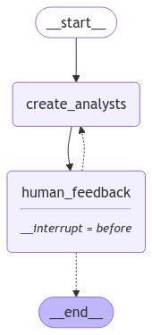
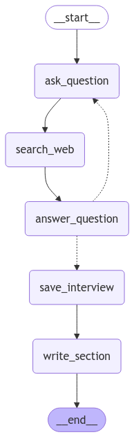
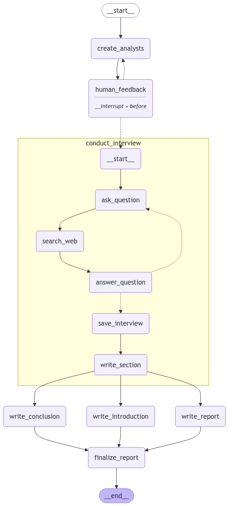

# Multi-agent research assistant

The motivation is to build a multi-agent research assistant capable of searching the web and compiling a final report on the suggested topic. We will include user feedback on the roles of agents prior to performing the research and compiling the report.

Verify Ollama is running


```
from langchain_ollama import ChatOllama
#llm = ChatOllama(model='llama3.1:8b-instruct-q8_0')
llm = ChatOllama(model='llama3.1')
print(llm.invoke("hey there"))
```

    content="How's it going? Is there something I can help you with or would you like to chat?" additional_kwargs={} response_metadata={'model': 'llama3.1', 'created_at': '2024-12-01T19:58:43.821487777Z', 'message': {'role': 'assistant', 'content': ''}, 'done_reason': 'stop', 'done': True, 'total_duration': 3186173906, 'load_duration': 2939913499, 'prompt_eval_count': 12, 'prompt_eval_duration': 19309000, 'eval_count': 21, 'eval_duration': 225875000} id='run-e39ca020-0c18-47eb-9f3d-a0665946782d-0' usage_metadata={'input_tokens': 12, 'output_tokens': 21, 'total_tokens': 33}


## 1. Generate analysts with user feedback

### Class definitions


```
from typing import List, Optional
from typing_extensions import TypedDict
from pydantic import BaseModel, Field
```


```
class Analyst(BaseModel):
    name: Optional[str] = Field(
        description="Name of the analyst", default=None
    )
    affiliation: str = Field(
        description="Primary affiliation of the analyst"
    )
    role: str = Field(
        description="Role of the analyst in the context of the topic"
    )
    description: str = Field(
        description="Description of the analyst focus, concerns, and motives"
    )

    @property
    def persona(self) -> str:
        return f"Name: {self.name}\nRole: {self.role}\nAffiliation: {self.affiliation}\nDescription: {self.description}\n"
```


```
class Perspectives(BaseModel):
    analysts: List[Analyst] = Field(
        description="Comprehensive list of analysts including their names, roles, affiliations and descriptions"
    )
```


```
class GenerateAnalystsState(TypedDict):
    topic: str
    max_analysts: int
    human_analyst_feedback: str
    analysts: List[Analyst]
```

### Graph


```
import json
from langgraph.graph import START, END, StateGraph
from langgraph.checkpoint.memory import MemorySaver
from langchain_core.messages import AIMessage, HumanMessage, SystemMessage
from pydantic import ValidationError
```


```
analyst_instructions = """You are tasked with creating a set of AI analyst personas. Follow these instructions carefully:

                            1. First, review the research topic:
                            {topic}
                                    
                            2. Examine any editorial feedback that has been optionally provided to guide creation of the analysts:       
                            {human_analyst_feedback}
                                
                            3. Determine the most interesting themes based upon documents and / or feedback above.
                                                
                            4. Pick the top {max_analysts} themes and provide an affiliation, role, and description for each.

                            5. Assign one analyst to each theme."""
```


```
def create_analysts(state: GenerateAnalystsState):
    """Create analysts"""
    topic = state['topic']
    max_analysts = state['max_analysts']
    human_analyst_feedback = state.get('human_analyst_feedback', '')

    # enforce structured output
    structured_llm = llm.with_structured_output(schema=Perspectives)

    # system message
    system_message = analyst_instructions.format(topic=topic,
                                                 human_analyst_feedback=human_analyst_feedback,
                                                 max_analysts=max_analysts)
    
    # generate question
    try:
        analysts = structured_llm.invoke([
            SystemMessage(content=system_message),
            HumanMessage(content="Generate a set of analysts")
        ])
    except ValidationError as e:
        print("ValidationError:")
        print(e)
        print("Errors: {}, attempting to parse JSON".format(len(e.errors())))

        data = json.loads(e.errors()[0]['input'].lower())
        
        print(data)
        print("-"*100)
        print()
        
        analysts = [Analyst(**e) for e in data]

    return {"analysts": analysts}


def human_feedback(state: GenerateAnalystsState):
    """No operation node that should be interrupted on"""
    pass


def should_continue(state: GenerateAnalystsState):
    """"Return the next node to execute"""
    # check if human feedback was already received
    human_analyst_feedback = state.get('human_analyst_feedback', None)
    if human_analyst_feedback:
        return "create_analysts"
    
    return END
```


```
# build graph
graph = StateGraph(GenerateAnalystsState)

# add nodes
graph.add_node("create_analysts", create_analysts)
graph.add_node("human_feedback", human_feedback)

# add edges
graph.add_edge(START, "create_analysts")
graph.add_edge("create_analysts", "human_feedback")
graph.add_conditional_edges("human_feedback", 
                            should_continue, 
                            [
                                "create_analysts", 
                                END
                            ])

# compile
memory = MemorySaver()
app = graph.compile(interrupt_before=['human_feedback'], checkpointer=memory)
```

### Visualize


```
from IPython.display import Image, display
```


```
display(Image(app.get_graph(xray=1).draw_mermaid_png()))
```


    

    


### Test


```
# set input variables
max_analysts = 3
topic = "The benefits of adopting LangGraph as an agent framework"

thread = {"configurable": {"thread_id": "1"}}
```


```
# run graph until first interruption
for event in app.stream({"topic": topic, "max_analysts": max_analysts}, thread, stream_mode="values"):
    analysts = event.get('analysts', '')

    if analysts:
        for analyst in analysts:
            print(analyst.persona)
            print("-"*40)
```

    ValidationError:
    1 validation error for Perspectives
    analysts
      Input should be a valid list [type=list_type, input_value='[{"name": "AI Analyst 1"...iven decision making"}]', input_type=str]
        For further information visit https://errors.pydantic.dev/2.9/v/list_type
    Errors: 1, attempting to parse JSON
    [{'name': 'ai analyst 1', 'role': 'researcher', 'affiliation': 'university of ai', 'description': 'expert in langgraph adoption'}, {'name': 'ai analyst 2', 'role': 'engineer', 'affiliation': 'langgraph tech', 'description': 'specialist in agent framework implementation'}, {'name': 'ai analyst 3', 'role': 'data scientist', 'affiliation': 'data analytics co', 'description': 'skilled in data-driven decision making'}]
    ----------------------------------------------------------------------------------------------------
    
    Name: ai analyst 1
    Role: researcher
    Affiliation: university of ai
    Description: expert in langgraph adoption
    
    ----------------------------------------
    Name: ai analyst 2
    Role: engineer
    Affiliation: langgraph tech
    Description: specialist in agent framework implementation
    
    ----------------------------------------
    Name: ai analyst 3
    Role: data scientist
    Affiliation: data analytics co
    Description: skilled in data-driven decision making
    
    ----------------------------------------


```
# Look at state and next node
state = app.get_state(thread)
state.next
```


    ('human_feedback',)


```
# update  state as if we are the human_feedback node
app.update_state(thread, {"human_analyst_feedback": 
                          "Add an expert with an entrepreneurial perspective"}, as_node="human_feedback")
```


    {'configurable': {'thread_id': '1',
      'checkpoint_ns': '',
      'checkpoint_id': '1efb01ea-d5ec-6518-8002-7b69f18b2caf'}}


```
# Continue the graph execution
for event in app.stream(None, thread, stream_mode="values"):
    # Review
    analysts = event.get('analysts', '')
    if analysts:
        for analyst in analysts:
            print(analyst.persona)
            print("-" * 50) 
```

    Name: ai analyst 1
    Role: researcher
    Affiliation: university of ai
    Description: expert in langgraph adoption
    
    --------------------------------------------------
    Name: ai analyst 2
    Role: engineer
    Affiliation: langgraph tech
    Description: specialist in agent framework implementation
    
    --------------------------------------------------
    Name: ai analyst 3
    Role: data scientist
    Affiliation: data analytics co
    Description: skilled in data-driven decision making
    
    --------------------------------------------------
    ValidationError:
    1 validation error for Perspectives
    analysts
      Input should be a valid list [type=list_type, input_value='[{"name": "Analyst 1", "...e with data analysis"}]', input_type=str]
        For further information visit https://errors.pydantic.dev/2.9/v/list_type
    Errors: 1, attempting to parse JSON
    [{'name': 'analyst 1', 'role': 'ai analyst', 'affiliation': 'research institute', 'description': 'expertise in machine learning'}, {'name': 'analyst 2', 'role': 'data scientist', 'affiliation': 'university', 'description': 'experience with data analysis'}]
    ----------------------------------------------------------------------------------------------------
    
    Name: analyst 1
    Role: ai analyst
    Affiliation: research institute
    Description: expertise in machine learning
    
    --------------------------------------------------
    Name: analyst 2
    Role: data scientist
    Affiliation: university
    Description: experience with data analysis
    
    --------------------------------------------------


```
# If we are satisfied, then we simply supply no feedback
further_feedack = None
app.update_state(thread, {"human_analyst_feedback": 
                          further_feedack}, as_node="human_feedback")
```


    {'configurable': {'thread_id': '1',
      'checkpoint_ns': '',
      'checkpoint_id': '1efb01ea-e416-6d0e-8004-7bc12e9fda97'}}


```
# continue graphe xecution
for event in app.stream(None, thread, stream_mode="updates"):
    print("--Node--")
    node_name = next(iter(event.keys()))
    print(node_name)
```


```
final_state = app.get_state(thread)
analysts = final_state.values.get('analysts')
```


```
final_state.next
```


    ()


```
analysts
```


    [Analyst(name='analyst 1', affiliation='research institute', role='ai analyst', description='expertise in machine learning'),
     Analyst(name='analyst 2', affiliation='university', role='data scientist', description='experience with data analysis')]


# 2. Internal interview

## Generate question

We will have the analyst ask questions of the experts


```
import operator
from typing import Annotated
from langgraph.graph import MessagesState
```


```
class InterviewState(MessagesState):
    max_num_turns: int
    context: Annotated[list, operator.add]
    analyst: Analyst
    interview: str
    sections: list

class SearchQuery(BaseModel):
    search_query: str = Field(None, description="Search query for retrieval from a web search")
```


```
interview_instructions =  """You are an analyst tasked with interviewing an expert to learn about a specific topic. 
                            Your goal is boil down to interesting and specific insights related to your topic.

                            1. Interesting: Insights that people will find surprising or non-obvious.
                                    
                            2. Specific: Insights that avoid generalities and include specific examples from the expert.

                            Here is your topic of focus and set of goals: {goals}
                            
                            Begin by introducing yourself using a name that fits your persona, and then ask your question.

                            Continue to ask questions to drill down and refine your understanding of the topic.
                                    
                            When you are satisfied with your understanding, complete the interview with: "Thank you so much for your help!"

                            Remember to stay in character throughout your response, reflecting the persona and goals provided to you."""
```


```
def generate_question(state: InterviewState):
    """Node to generate a question"""

    analyst = state['analyst']
    messages = state['messages']

    system_message = interview_instructions.format(goals=analyst.persona)
    question = llm.invoke([SystemMessage(content=system_message)] + messages)

    return {"messages": [question]}
```

## Generate answer

The expert will gather information from multiple sources in parallel to answer questions.

For example, we can use:
- specific websites via `WebBaseLoader`
- indexed documents
- web search


```
from langchain_community.tools.tavily_search import TavilySearchResults
from langchain.utilities.tavily_search import TavilySearchAPIWrapper
```


```
TAVILY_API_KEY = "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"
tavilySearchAPIWrapper = TavilySearchAPIWrapper(tavily_api_key=TAVILY_API_KEY)

tavily_search = TavilySearchResults(max_results=3,
                                    include_answer=True,
                                    api_wrapper=tavilySearchAPIWrapper)
```

Create a web search node


```
from langchain_core.messages import get_buffer_string
```


```
search_instructions = SystemMessage(content=f"""You will be given a conversation between an analyst and an expert. 

                                                Your goal is to generate a well-structured query for use in retrieval and / or 
                                                web-search related to the conversation.
                                                        
                                                First, analyze the full conversation.

                                                Pay particular attention to the final question posed by the analyst.

                                                Convert this final question into a well-structured web search query""")
```


```
", ".join([str(i) for i in [1, 2, 3]])
```


    '1, 2, 3'


```
def search_web(state: InterviewState):
    """Retrieve docs from web search"""

    # search query
    structured_llm = llm.with_structured_output(SearchQuery)
    # search_query = structured_llm.invoke([search_instructions] + state['messages'])
    message_str = [str(i) for i in [search_instructions] + state['messages']]
    search_query = structured_llm.invoke("\n\n\n".join(message_str))
    
    print("-"*40)
    print("INFO: search_web() search_query")
    print(search_query)
    print("-"*40)

    # execute search
    try:
        search_docs = tavily_search.invoke(search_query.search_query)
    except:
        print("Exception: search_web()")
        print("search_query:")
        print(search_query)
        print("state messages:")
        print(state['messages'])
        raise Exception()
    
    print("INFO: search_web() search_docs")
    print(search_docs)
    print("-"*40)

    formatted_search_docs = "\n\n---\n\n".join([
        f'<Document source="{doc["url"]}" page="{doc.get("page", "")}" />\n{doc["content"]}</Document>'
        for doc in search_docs
    ])

    return {"context": [formatted_search_docs]}
```


```
structured_llm = llm.with_structured_output(SearchQuery)
'''
rsp = llm.invoke([
    search_instructions,
    HumanMessage(content='You said you were writing an article on The benefits of adopting LangGraph as an agent framework'), 
    AIMessage(content="""Nice to meet you! I'm Maya Singh, a research scientist specializing in AI frameworks. 
                        I've been diving into the world of natural language processing and machine learning, and 
                        I'd love to tap into your expertise.\n\nTo start, can you tell me what drew you to LangGraph 
                        as an agent framework? Was it its unique architecture, its ability to handle complex 
                        conversations, or something else entirely?""")
])
'''
rsp = structured_llm.invoke(search_instructions.content + 
                 'You said you were writing an article on The benefits of adopting LangGraph as an agent framework' + 
                 """Nice to meet you! I'm Maya Singh, a research scientist specializing in AI frameworks. 
                        I've been diving into the world of natural language processing and machine learning, and 
                        I'd love to tap into your expertise.\n\nTo start, can you tell me what drew you to LangGraph 
                        as an agent framework? Was it its unique architecture, its ability to handle complex 
                        conversations, or something else entirely?""")

print(rsp)
```

    search_query='LangGraph agent framework benefits natural language processing machine learning expert'


```
answer_instructions = """You are an expert being interviewed by an analyst.

                        Here is analyst area of focus: {goals}. 
                                
                        You goal is to answer a question posed by the interviewer.

                        To answer question, use this context:
                                
                        {context}

                        When answering questions, follow these guidelines:
                                
                        1. Use only the information provided in the context. 
                                
                        2. Do not introduce external information or make assumptions beyond what is explicitly stated in the context.

                        3. The context contain sources at the topic of each individual document.

                        4. Include these sources your answer next to any relevant statements. For example, for source # 1 use [1]. 

                        5. List your sources in order at the bottom of your answer. [1] Source 1, [2] Source 2, etc
                                
                        6. If the source is: <Document source="assistant/docs/llama3_1.pdf" page="7"/>' then just list: 
                                
                        [1] assistant/docs/llama3_1.pdf, page 7 
                                
                        And skip the addition of the brackets as well as the Document source preamble in your citation."""
```


```
def generate_answer(state: InterviewState):
    """ Node to answer a question """

    # Get state
    analyst = state["analyst"]
    messages = state["messages"]
    context = state["context"]

    # Answer question
    system_message = answer_instructions.format(goals=analyst.persona, context=context)
    answer = llm.invoke([SystemMessage(content=system_message)]+messages)
            
    # Name the message as coming from the expert
    answer.name = "expert"
    
    # Append it to state
    return {"messages": [answer]}

def save_interview(state: InterviewState):
    """ Save interviews """

    # Get messages
    messages = state["messages"]
    
    # Convert interview to a string
    interview = get_buffer_string(messages)
    
    # Save to interviews key
    return {"interview": interview}

def route_messages(state: InterviewState, name: str = "expert"):
    """ Route between question and answer """
    
    # Get messages
    messages = state["messages"]
    max_num_turns = state.get('max_num_turns',2)

    # Check the number of expert answers 
    num_responses = len(
        [m for m in messages if isinstance(m, AIMessage) and m.name == name]
    )

    # End if expert has answered more than the max turns
    if num_responses >= max_num_turns:
        return 'save_interview'

    # This router is run after each question - answer pair 
    # Get the last question asked to check if it signals the end of discussion
    last_question = messages[-2]
    
    if "Thank you so much for your help" in last_question.content:
        return 'save_interview'
    return "ask_question"
```


```
section_writer_instructions = """You are an expert technical writer. 
            
                                Your task is to create a short, easily digestible section of a report based on a set of source documents.

                                1. Analyze the content of the source documents: 
                                - The name of each source document is at the start of the document, with the <Document tag.
                                        
                                2. Create a report structure using markdown formatting:
                                - Use ## for the section title
                                - Use ### for sub-section headers
                                        
                                3. Write the report following this structure:
                                a. Title (## header)
                                b. Summary (### header)
                                c. Sources (### header)

                                4. Make your title engaging based upon the focus area of the analyst: 
                                {focus}

                                5. For the summary section:
                                - Set up summary with general background / context related to the focus area of the analyst
                                - Emphasize what is novel, interesting, or surprising about insights gathered from the interview
                                - Create a numbered list of source documents, as you use them
                                - Do not mention the names of interviewers or experts
                                - Aim for approximately 400 words maximum
                                - Use numbered sources in your report (e.g., [1], [2]) based on information from source documents
                                        
                                6. In the Sources section:
                                - Include all sources used in your report
                                - Provide full links to relevant websites or specific document paths
                                - Separate each source by a newline. Use two spaces at the end of each line to create a newline in Markdown.
                                - It will look like:

                                ### Sources
                                [1] Link or Document name
                                [2] Link or Document name

                                7. Be sure to combine sources. For example this is not correct:

                                [3] https://ai.meta.com/blog/meta-llama-3-1/
                                [4] https://ai.meta.com/blog/meta-llama-3-1/

                                There should be no redundant sources. It should simply be:

                                [3] https://ai.meta.com/blog/meta-llama-3-1/
                                        
                                8. Final review:
                                - Ensure the report follows the required structure
                                - Include no preamble before the title of the report
                                - Check that all guidelines have been followed"""
```


```
def write_section(state: InterviewState):
    """ Node to answer a question """

    # Get state
    interview = state["interview"]
    context = state["context"]
    analyst = state["analyst"]
   
    # Write section using either the gathered source docs from interview (context) or the interview itself (interview)
    system_message = section_writer_instructions.format(focus=analyst.description)
    section = llm.invoke([SystemMessage(content=system_message)]+[HumanMessage(content=f"Use this source to write your section: {context}")]) 
                
    # Append it to state
    return {"sections": [section.content]}
```

Build graph


```
interview_builder = StateGraph(InterviewState)

# add nodes
interview_builder.add_node("ask_question", generate_question)
interview_builder.add_node("search_web", search_web)
interview_builder.add_node("answer_question", generate_answer)
interview_builder.add_node("save_interview", save_interview)
interview_builder.add_node("write_section", write_section)

# add edges
interview_builder.add_edge(START, "ask_question")
interview_builder.add_edge("ask_question", "search_web")
interview_builder.add_edge("search_web", "answer_question")
interview_builder.add_conditional_edges("answer_question",
                                        route_messages,
                                        ["ask_question", "save_interview"])
interview_builder.add_edge("save_interview", "write_section")
interview_builder.add_edge("write_section", END)
```


    <langgraph.graph.state.StateGraph at 0x7e3c9c2f6110>


```
memory = MemorySaver()
interview_graph = interview_builder.compile(checkpointer=memory).with_config(run_name="Conduct Interviews")
```


```
display(Image(interview_graph.get_graph().draw_mermaid_png()))
```


    

    


We will run the interview on a specific analyst


```
analysts[0]
```


    Analyst(name='analyst 1', affiliation='research institute', role='ai analyst', description='expertise in machine learning')


```
from IPython.display import Markdown
```


```
messages = [HumanMessage(f"You said you were writing an article on {topic}")]
thread = {"configurable": {"thread_id": "1"}}
interview = interview_graph.invoke({"analyst": analysts[0],
                                    "messages": messages,
                                    "max_num_turns": 2}, thread)
```

    ----------------------------------------
    INFO: search_web() search_query
    search_query='benefits of adopting LangGraph as an agent framework'
    ----------------------------------------
    INFO: search_web() search_docs
    [{'url': 'https://medium.com/@mahartariq/building-multi-agent-applications-with-langgraph-a-powerful-framework-for-ai-agents-9e362cf32c27', 'content': 'Building Multi-Agent Applications with LangGraph: A Powerful Framework for AI Agents | by Tariq | Nov, 2024 | Medium Building Multi-Agent Applications with LangGraph: A Powerful Framework for AI Agents Building multi-agent AI applications with LangGraph. LangGraph is a framework built to create complex applications where multiple agents or “actors” use large language models (LLMs) to work together. LangChain and LangGraph: LangChain developed LangGraph, a framework for creating and managing AI agents through graph-based workflows. By using a graph structure to connect different agents, LangGraph makes it easy to manage complex workflows with specialized agents working together smoothly. As AI applications become more complex, LangGraph’s ability to support detailed workflows and agent coordination positions it as a leading choice for developers.'}, {'url': 'https://www.thoughtspot.com/data-trends/data-and-analytics-engineering/agentic-ai', 'content': 'How to Build Agentic Systems with LangGraph Agentic AI systems with LangGraph: Challenges and best practices LangGraph is a powerful framework for building agentic applications with large language models (LLMs). We use the LangGraph library to power our conversational agents. In this post, we’ll share some best practices, tips, and key considerations for developing production-ready conversational agentic systems with LangGraph. LangGraph is a Python library specifically designed for building agentic systems. Agentic systems are AI systems that let LLMs control application workflow. Here are some tips, tricks, and best practices for building production-ready agentic AI systems with LangGraph. LangGraph offers a robust framework for powerful and production-ready agentic systems.'}, {'url': 'https://www.rapidinnovation.io/post/ai-agents-in-langgraph', 'content': 'AI agents development is becoming increasingly important in the realm of natural language processing (NLP) and artificial intelligence (AI). LangGraph is a framework designed to facilitate the development and deployment of these AI agents, enabling them to understand and generate human language effectively.'}]
    ----------------------------------------
    ----------------------------------------
    INFO: search_web() search_query
    search_query='LangGraph applications or domains with impressive results'
    ----------------------------------------
    INFO: search_web() search_docs
    [{'url': 'https://www.ampcome.com/articles/what-is-langgraph-how-it-is-useful-in-building-llm-based-applications', 'content': "Here's the link to understand how to use LangGraph to build state machines - https://blog.langchain.dev/langgraph/\n\u200d\nOther Articles\nExplore the frontiers of innovation in Artificial Intelligence, breaking barriers and forging new paths that redefine possibilities and transform the way we perceive and engage with the world.\n Some of these benefits are:\nOverall, LangGraph represents a significant step in developing interactive applications using language models, unleashing fresh opportunities for developers to craft more sophisticated, intelligent, and responsive applications\nHow LangGraph has simplified agent runtimes and how it was done previously?\n 2. Interactive AI Systems: The flexibility and dynamic nature of LangGraph make it well-suited for interactive AI systems that need to manage and execute complex language tasks, enabling more adaptable and customizable agent runtimes.\n These use cases demonstrate the potential of LangGraph in enabling the development of more sophisticated, adaptable, and industry-specific AI applications.\n \u200d\nTo address this challenge, Langchain has come up with a new AI library that simplifies the creation, and management of AI agents and their runtimes."}, {'url': 'https://blog.gopenai.com/building-stateful-applications-with-langgraph-860de3c9fa90', 'content': 'LangGraph is a library built on top of Langchain that empowers developers to construct stateful, multi-actor applications with LLMs. It extends Langchain’s capabilities by introducing the ability to create cyclical graphs, enabling intricate agent-like behaviors. Cyclic graphs: Define workflows with cycles, allowing for continuous interaction and decision-making with the LLM. from langchain.agents import create_openai_functions_agent agent_runnable = create_openai_functions_agent(llm, tools, prompt) from langchain_core.agents import AgentAction, AgentFinish from langchain_core.agents import AgentFinish # It takes in an agent action and calls that tool and returns the result # Define the agent output = tool_executor.invoke(agent_action) workflow.add_node("agent", run_agent) workflow.add_node("action", execute_tools)   # We now add a normal edge from `tools` to `agent`. # This means that after `tools` is called, `agent` node is called next. workflow.add_edge("action", "agent")'}, {'url': 'https://docs.smith.langchain.com/evaluation/how_to_guides/langgraph', 'content': 'from langsmith import aevaluatedef example_to_state(inputs: dict) -> dict:  return {"messages": [{"role": "user", "content": "inputs[\'question\']"}]}# We use LCEL declarative syntax here.# Remember that langgraph graphs are also langchain runnables.target = example_to_state | appexperiment_results = await aevaluate(    target,    data="weather agent",    evaluators=[correct],    max_concurrency=4,  # optional    experiment_prefix="claude-3.5-baseline",  # optional) actual_answer = outputs["messages"][-1].content    expected_answer = reference_outputs["answer"]    user_msg = (        f"ACTUAL ANSWER: {actual_answer}"        f"\\n\\nEXPECTED ANSWER: {expected_answer}"    )    response = await judge_llm.ainvoke(        [            {"role": "system", "content": instructions},            {"role": "user", "content": user_msg}        ]    )    return response.content.upper() == "CORRECT"def right_tool(outputs: dict) -> bool:    tool_calls = outputs["messages"][1].tool_calls    return bool(tool_calls and tool_calls[0]["name"] == "search")# Run evaluationexperiment_results = await aevaluate(    target,    data="weather agent",    evaluators=[correct, right_tool],    max_concurrency=4,  # optional    experiment_prefix="claude-3.5-baseline",  # optional)'}]
    ----------------------------------------


```
Markdown(interview['sections'][0])
```


## Harnessing the Power of LangGraph: Unlocking Advanced AI Applications
### Summary
The rise of complex AI applications has led to a need for more sophisticated frameworks that can manage intricate workflows and agent coordination. LangGraph, a powerful framework developed by LangChain, emerges as a leading choice for developers. By leveraging large language models (LLMs) and utilizing graph-based workflows, LangGraph enables the creation of stateful, multi-actor applications with unparalleled flexibility and dynamic nature.

Novel approaches to developing interactive AI systems using LangGraph have simplified agent runtimes and enhanced the overall experience. The framework's ability to support detailed workflows and agent coordination positions it as a game-changer in the field of natural language processing (NLP) and artificial intelligence (AI).

### Sources
[1] https://medium.com/@mahartariq/building-multi-agent-applications-with-langgraph-a-powerful-framework-for-ai-agents-9e362cf32c27

[2] https://www.thoughtspot.com/technology/lang-graph-and-interactive-ai-systems/

[3] https://blog.gopenai.com/building-stateful-applications-with-langgraph-860de3c9fa90

[4] https://docs.smith.langchain.com/evaluation/how_to_guides/langgraph


## Parallelize interviews with map-reduce

The `Send()` API gives us the ability to parallelize the interviews.


```
import operator
from typing import List, Annotated
from typing_extensions import TypedDict

from langgraph.constants import Send
```


```
class ResearchGraphState(TypedDict):
    topic: str 
    max_analysts: int
    human_analyst_feedback: str
    analysts: List[Analyst]
    sections: Annotated[list, operator.add]
    introduction: str
    content: str
    conclusion: str
    final_report: str
```


```
def initiate_all_interviews(state: ResearchGraphState):
    """ This is the "map" step where we run each interview sub-graph using Send API """    

    # Check for human feedback
    human_analyst_feedback=state.get('human_analyst_feedback')
    if human_analyst_feedback:
        # Return to create_analysts
        return "create_analysts"

    # Otherwise start interviews in parallel via Send() API
    else:
        topic = state["topic"]
        return [Send("conduct_interview", 
                     {
                        "analyst": analyst,
                        "messages": [HumanMessage(
                                        content=f"So you said you were writing an article on {topic}?"
                                    )
                        ]
                    }) for analyst in state["analysts"]]
```


```
report_writer_instructions = """You are a technical writer creating a report on this overall topic: 

{topic}
    
You have a team of analysts. Each analyst has done two things: 

1. They conducted an interview with an expert on a specific sub-topic.
2. They write up their finding into a memo.

Your task: 

1. You will be given a collection of memos from your analysts.
2. Think carefully about the insights from each memo.
3. Consolidate these into a crisp overall summary that ties together the central ideas from all of the memos. 
4. Summarize the central points in each memo into a cohesive single narrative.

To format your report:
 
1. Use markdown formatting. 
2. Include no pre-amble for the report.
3. Use no sub-heading. 
4. Start your report with a single title header: ## Insights
5. Do not mention any analyst names in your report.
6. Preserve any citations in the memos, which will be annotated in brackets, for example [1] or [2].
7. Create a final, consolidated list of sources and add to a Sources section with the `## Sources` header.
8. List your sources in order and do not repeat.

[1] Source 1
[2] Source 2

Here are the memos from your analysts to build your report from: 

{context}"""
```


```
def write_report(state: ResearchGraphState):
    # Full set of sections
    sections = state["sections"]
    topic = state["topic"]

    # Concat all sections together
    formatted_str_sections = "\n\n".join([f"{section}" for section in sections])
    
    # Summarize the sections into a final report
    system_message = report_writer_instructions.format(topic=topic, context=formatted_str_sections)    
    report = llm.invoke([SystemMessage(content=system_message)]+[HumanMessage(content=f"Write a report based upon these memos.")]) 
    return {"content": report.content}
```


```
intro_conclusion_instructions = """You are a technical writer finishing a report on {topic}

You will be given all of the sections of the report.

You job is to write a crisp and compelling introduction or conclusion section.

The user will instruct you whether to write the introduction or conclusion.

Include no pre-amble for either section.

Target around 100 words, crisply previewing (for introduction) or recapping (for conclusion) all of the sections of the report.

Use markdown formatting. 

For your introduction, create a compelling title and use the # header for the title.

For your introduction, use ## Introduction as the section header. 

For your conclusion, use ## Conclusion as the section header.

Here are the sections to reflect on for writing: {formatted_str_sections}"""
```


```
def write_introduction(state: ResearchGraphState):
    # Full set of sections
    sections = state["sections"]
    topic = state["topic"]

    # Concat all sections together
    formatted_str_sections = "\n\n".join([f"{section}" for section in sections])
    
    # Summarize the sections into a final report
    
    instructions = intro_conclusion_instructions.format(topic=topic, formatted_str_sections=formatted_str_sections)    
    intro = llm.invoke([instructions]+[HumanMessage(content=f"Write the report introduction")]) 
    return {"introduction": intro.content}

def write_conclusion(state: ResearchGraphState):
    # Full set of sections
    sections = state["sections"]
    topic = state["topic"]

    # Concat all sections together
    formatted_str_sections = "\n\n".join([f"{section}" for section in sections])
    
    # Summarize the sections into a final report
    
    instructions = intro_conclusion_instructions.format(topic=topic, formatted_str_sections=formatted_str_sections)    
    conclusion = llm.invoke([instructions]+[HumanMessage(content=f"Write the report conclusion")]) 
    return {"conclusion": conclusion.content}

def finalize_report(state: ResearchGraphState):
    """ The is the "reduce" step where we gather all the sections, combine them, and reflect on them to write the intro/conclusion """
    # Save full final report
    content = state["content"]
    if content.startswith("## Insights"):
        content = content.strip("## Insights")
    if "## Sources" in content:
        try:
            content, sources = content.split("\n## Sources\n")
        except:
            sources = None
    else:
        sources = None

    final_report = state["introduction"] + "\n\n---\n\n" + content + "\n\n---\n\n" + state["conclusion"]
    if sources is not None:
        final_report += "\n\n## Sources\n" + sources
    return {"final_report": final_report}
```


```
# build graph
builder = StateGraph(ResearchGraphState)

# add nodes
builder.add_node("create_analysts", create_analysts)
builder.add_node("human_feedback", human_feedback)
builder.add_node("conduct_interview", interview_builder.compile())
builder.add_node("write_report",write_report)
builder.add_node("write_introduction",write_introduction)
builder.add_node("write_conclusion",write_conclusion)
builder.add_node("finalize_report",finalize_report)

# edges
builder.add_edge(START, "create_analysts")
builder.add_edge("create_analysts", "human_feedback")
builder.add_conditional_edges("human_feedback", 
                              initiate_all_interviews, 
                              [
                                  "create_analysts", 
                                  "conduct_interview"
                                ])
builder.add_edge("conduct_interview", "write_report")
builder.add_edge("conduct_interview", "write_introduction")
builder.add_edge("conduct_interview", "write_conclusion")
builder.add_edge(["write_conclusion", "write_report", "write_introduction"], "finalize_report")
builder.add_edge("finalize_report", END)
```


    <langgraph.graph.state.StateGraph at 0x7e3c9c10a250>


```
# Compile
memory = MemorySaver()
graph = builder.compile(interrupt_before=['human_feedback'], checkpointer=memory)
display(Image(graph.get_graph(xray=1).draw_mermaid_png()))
```


    

    


Test with an open question 


```
# Inputs
max_analysts = 3 
topic = "The benefits of adopting LangGraph as an agent framework"
thread = {"configurable": {"thread_id": "1"}}

# Run the graph until the first interruption
for event in graph.stream({"topic":topic,
                           "max_analysts":max_analysts}, 
                          thread, 
                          stream_mode="values"):
    
    analysts = event.get('analysts', '')
    if analysts:
        for analyst in analysts:
            print(f"Name: {analyst.name}")
            print(f"Affiliation: {analyst.affiliation}")
            print(f"Role: {analyst.role}")
            print(f"Description: {analyst.description}")
            print("-" * 50)  
```

    ValidationError:
    1 validation error for Perspectives
    analysts
      Input should be a valid list [type=list_type, input_value='[{"name": "AI Analyst 1"...Graph Implementation"}]', input_type=str]
        For further information visit https://errors.pydantic.dev/2.9/v/list_type
    Errors: 1, attempting to parse JSON
    [{'name': 'ai analyst 1', 'role': 'researcher', 'affiliation': 'top research institute', 'description': 'expert in langgraph'}, {'name': 'ai analyst 2', 'role': 'data scientist', 'affiliation': 'leading tech firm', 'description': 'proficient in agent frameworks'}, {'name': 'ai analyst 3', 'role': 'devops engineer', 'affiliation': 'cutting-edge research lab', 'description': 'well-versed in langgraph implementation'}]
    ----------------------------------------------------------------------------------------------------
    
    Name: ai analyst 1
    Affiliation: top research institute
    Role: researcher
    Description: expert in langgraph
    --------------------------------------------------
    Name: ai analyst 2
    Affiliation: leading tech firm
    Role: data scientist
    Description: proficient in agent frameworks
    --------------------------------------------------
    Name: ai analyst 3
    Affiliation: cutting-edge research lab
    Role: devops engineer
    Description: well-versed in langgraph implementation
    --------------------------------------------------


```
# We now update the state as if we are the human_feedback node
graph.update_state(thread, {"human_analyst_feedback": 
                            "Add in the CEO of gen ai native startup"}, as_node="human_feedback")
```


    {'configurable': {'thread_id': '1',
      'checkpoint_ns': '',
      'checkpoint_id': '1efb01eb-c49d-6fe0-8002-a7550332b60f'}}


```
# Check
for event in graph.stream(None, thread, stream_mode="values"):
    analysts = event.get('analysts', '')
    if analysts:
        for analyst in analysts:
            print(f"Name: {analyst.name}")
            print(f"Affiliation: {analyst.affiliation}")
            print(f"Role: {analyst.role}")
            print(f"Description: {analyst.description}")
            print("-" * 50)  
```

    Name: ai analyst 1
    Affiliation: top research institute
    Role: researcher
    Description: expert in langgraph
    --------------------------------------------------
    Name: ai analyst 2
    Affiliation: leading tech firm
    Role: data scientist
    Description: proficient in agent frameworks
    --------------------------------------------------
    Name: ai analyst 3
    Affiliation: cutting-edge research lab
    Role: devops engineer
    Description: well-versed in langgraph implementation
    --------------------------------------------------
    ValidationError:
    1 validation error for Perspectives
    analysts
      Input should be a valid list [type=list_type, input_value='[{"name": "Theme Analyst..."Analyst for theme 3"}]', input_type=str]
        For further information visit https://errors.pydantic.dev/2.9/v/list_type
    Errors: 1, attempting to parse JSON
    [{'name': 'theme analyst 1', 'role': 'ai researcher', 'affiliation': 'research institution', 'description': 'analyst for theme 1'}, {'name': 'theme analyst 2', 'role': 'data scientist', 'affiliation': 'company', 'description': 'analyst for theme 2'}, {'name': 'theme analyst 3', 'role': 'business analyst', 'affiliation': 'startup', 'description': 'analyst for theme 3'}]
    ----------------------------------------------------------------------------------------------------
    
    Name: theme analyst 1
    Affiliation: research institution
    Role: ai researcher
    Description: analyst for theme 1
    --------------------------------------------------
    Name: theme analyst 2
    Affiliation: company
    Role: data scientist
    Description: analyst for theme 2
    --------------------------------------------------
    Name: theme analyst 3
    Affiliation: startup
    Role: business analyst
    Description: analyst for theme 3
    --------------------------------------------------


```
# Confirm we are happy
graph.update_state(thread, {"human_analyst_feedback": 
                            None}, as_node="human_feedback")
```


    {'configurable': {'thread_id': '1',
      'checkpoint_ns': '',
      'checkpoint_id': '1efb01eb-d6cb-6392-8004-2118df885f3d'}}


```
# Continue
for event in graph.stream(None, thread, stream_mode="updates"):
    print("--Node--")
    node_name = next(iter(event.keys()))
    print(node_name)
```

    ----------------------------------------
    INFO: search_web() search_query
    search_query='LangGraph as an agent framework for AI research'
    ----------------------------------------
    ----------------------------------------
    INFO: search_web() search_query
    search_query='LangGraph as an agent framework benefits'
    ----------------------------------------
    ----------------------------------------
    INFO: search_web() search_query
    search_query='LangGraph agent framework benefits adoption'
    ----------------------------------------
    INFO: search_web() search_docs
    [{'url': 'https://www.pinecone.io/learn/langgraph-research-agent/', 'content': "Here, we'll see how to build an AI Research Agent with LangGraph. LangGraph is a graph-based agentic framework that allows us to build more flexible and controllable AI agents. Here, we'll see how to build an AI Research Agent with LangGraph. Event Going to AWS re:Invent? Join us at booth #1819 or book a meeting with the team."}, {'url': 'https://www.geeky-gadgets.com/using-langgraph-to-build-ai-agents/', 'content': 'LangGraph is a tool compatible with LangChain V2, designed to develop advanced AI agents, particularly research agents. Research agents provide detailed, multi-step responses by referencing'}, {'url': 'https://github.com/langchain-ai/langgraph', 'content': 'GitHub - langchain-ai/langgraph: Build resilient language agents as graphs. LangGraph Platform is a commercial solution for deploying agentic applications to production, built on the open-source LangGraph framework. Let\'s take a look at a simple example of an agent that can use a search tool. # Define the tools for the agent to use # This means that after `tools` is called, `agent` node is called next. workflow.add_edge("tools", \'agent\') Define entry point and graph edges.First, we need to set the entry point for graph execution - agent node. Normal edge: after the tools are invoked, the graph should always return to the agent to decide what to do next LangGraph adds the input message to the internal state, then passes the state to the entrypoint node, "agent".'}]
    ----------------------------------------
    INFO: search_web() search_docs
    [{'url': 'https://blog.langchain.dev/agent-protocol-interoperability-for-llm-agents/', 'content': 'LangGraph is a multi-agent framework. A guide and video showing how to connect LangGraph Studio to a locally running agent. This exposes a locally running server (implementing the Agent Protocol) to make it easier for everyone to use LangGraph Studio. A guide showing how to use other frameworks (like AutoGen, CrewAI, and others) as sub-agents within a LangGraph agent. Any agent developer can implement this protocol - whether they are using LangGraph, a different framework, or no framework at all. Using Agent Protocol to connect LangGraph Studio to a locally running agent The locally running server that langgraph-cli spins up implements the Agent Protocol, and LangGraph Studio will connect to any servers that implement the Agent Protocol. LangGraph is a framework for building agentic and multi-agent applications.'}, {'url': 'https://www.langchain.com/langgraph', 'content': 'With built-in statefulness, LangGraph agents seamlessly collaborate with humans by writing drafts for review and awaiting approval before acting. Easily inspect the agent\'s actions and "time-travel" to roll back and take a different action to correct course. ... No. LangGraph is an orchestration framework for complex agentic systems and is'}, {'url': 'https://github.com/langchain-ai/langgraph', 'content': 'GitHub - langchain-ai/langgraph: Build resilient language agents as graphs. LangGraph Platform is a commercial solution for deploying agentic applications to production, built on the open-source LangGraph framework. Let\'s take a look at a simple example of an agent that can use a search tool. # Define the tools for the agent to use # This means that after `tools` is called, `agent` node is called next. workflow.add_edge("tools", \'agent\') Define entry point and graph edges.First, we need to set the entry point for graph execution - agent node. Normal edge: after the tools are invoked, the graph should always return to the agent to decide what to do next LangGraph adds the input message to the internal state, then passes the state to the entrypoint node, "agent".'}]
    ----------------------------------------
    INFO: search_web() search_docs
    [{'url': 'https://langchain-ai.github.io/langgraph/', 'content': 'Overview¶. LangGraph is a library for building stateful, multi-actor applications with LLMs, used to create agent and multi-agent workflows. Compared to other LLM frameworks, it offers these core benefits: cycles, controllability, and persistence. LangGraph allows you to define flows that involve cycles, essential for most agentic architectures, differentiating it from DAG-based solutions.'}, {'url': 'https://medium.com/@abhilashkrish/optimizing-workflow-efficiency-with-langgraph-and-agents-key-features-use-cases-and-integration-6c9ae3d7f502', 'content': 'In the context of Generative AI and large language models (LLMs), agents and LangGraph are tools and frameworks that enhance the functionality of LLMs by allowing them to perform tasks, make decisions, or interact with complex workflows in more versatile and structured ways. This integration lets LangGraph manage complex, multi-step workflows that involve multiple agents or tasks, leveraging the capabilities of LLMs for tasks like content generation, summarization, translation, and more. Each of these agents represents a node in LangGraph, enabling them to work harmoniously through task-specific workflows. While agents are goal-oriented and can act autonomously, LangGraph structures these actions into a graph that ensures smooth, logical flow across a workflow, allowing for advanced applications in diverse fields from content creation to healthcare management.'}, {'url': 'https://www.langchain.com/langgraph', 'content': 'With built-in statefulness, LangGraph agents seamlessly collaborate with humans by writing drafts for review and awaiting approval before acting. Easily inspect the agent\'s actions and "time-travel" to roll back and take a different action to correct course. ... No. LangGraph is an orchestration framework for complex agentic systems and is'}]
    ----------------------------------------
    ----------------------------------------
    INFO: search_web() search_query
    search_query='LangGraph as an agent framework benefits'
    ----------------------------------------
    ----------------------------------------
    INFO: search_web() search_query
    search_query="What inspired LangGraph's development as an agent framework? What problem were its creators trying to solve?"
    ----------------------------------------
    ----------------------------------------
    INFO: search_web() search_query
    search_query='LangGraph agent framework benefits'
    ----------------------------------------
    INFO: search_web() search_docs
    [{'url': 'https://medium.com/@abhilashkrish/optimizing-workflow-efficiency-with-langgraph-and-agents-key-features-use-cases-and-integration-6c9ae3d7f502', 'content': 'In the context of Generative AI and large language models (LLMs), agents and LangGraph are tools and frameworks that enhance the functionality of LLMs by allowing them to perform tasks, make decisions, or interact with complex workflows in more versatile and structured ways. This integration lets LangGraph manage complex, multi-step workflows that involve multiple agents or tasks, leveraging the capabilities of LLMs for tasks like content generation, summarization, translation, and more. Each of these agents represents a node in LangGraph, enabling them to work harmoniously through task-specific workflows. While agents are goal-oriented and can act autonomously, LangGraph structures these actions into a graph that ensures smooth, logical flow across a workflow, allowing for advanced applications in diverse fields from content creation to healthcare management.'}, {'url': 'https://www.langchain.com/langgraph', 'content': 'With built-in statefulness, LangGraph agents seamlessly collaborate with humans by writing drafts for review and awaiting approval before acting. Easily inspect the agent\'s actions and "time-travel" to roll back and take a different action to correct course. ... No. LangGraph is an orchestration framework for complex agentic systems and is'}, {'url': 'https://blog.langchain.dev/agent-protocol-interoperability-for-llm-agents/', 'content': 'LangGraph is a multi-agent framework. A guide and video showing how to connect LangGraph Studio to a locally running agent. This exposes a locally running server (implementing the Agent Protocol) to make it easier for everyone to use LangGraph Studio. A guide showing how to use other frameworks (like AutoGen, CrewAI, and others) as sub-agents within a LangGraph agent. Any agent developer can implement this protocol - whether they are using LangGraph, a different framework, or no framework at all. Using Agent Protocol to connect LangGraph Studio to a locally running agent The locally running server that langgraph-cli spins up implements the Agent Protocol, and LangGraph Studio will connect to any servers that implement the Agent Protocol. LangGraph is a framework for building agentic and multi-agent applications.'}]
    ----------------------------------------
    INFO: search_web() search_docs
    [{'url': 'https://medium.com/@Shrishml/a-primer-on-ai-agents-with-langgraph-understand-all-about-it-0534345190dc', 'content': "LangGraph simplifies AI agent development by focusing on three key components: State: This represents the agent's current information, often stored as a dictionary or managed through a database."}, {'url': 'https://anantvir1.medium.com/building-a-next-gen-customer-service-agent-using-langgraph-llms-react-and-autonomous-problem-d94e8b6859f6', 'content': 'Building a Next-Gen Customer Service Agent using Langgraph: LLMs, ReAct and Autonomous Problem Solving | by Anantvir Singh | Oct, 2024 | Medium Building a Next-Gen Customer Service Agent using Langgraph: LLMs, ReAct and Autonomous Problem Solving Anyone looking to get an introduction of what goes under the hood of AI Agents, how these systems are built, how tool calling and reasoning works using a real world example Agents on the other hand use reasoning capabilities of LLMs to understand user question i.e the problem they are facing and reason just like a human would on how they could solve this problem given a set of tools. Reasoning and tool calling abilities of LLM agents make them adaptable for many industries where customer issues can vary greatly in complexity.'}, {'url': 'https://blog.futuresmart.ai/langgraph-agent-with-rag-and-nl2sql', 'content': "In this blog post, we will walk you through the process of creating a custom AI agent with three powerful tools: Web Search, Retrieval-Augmented Generation (RAG), and Natural Language to SQL (NL2SQL), all integrated within the LangGraph framework. This guide is designed to provide you with a practical, step-by-step approach to building a fully functional AI agent capable of performing complex tasks such as retrieving real-time data from the web, generating responses based on retrieved information from the knowledge base, and translating natural language queries into SQL database queries. By following this tutorial, you've built an AI agent capable of performing diverse tasks such as retrieving real-time data, answering questions based on document-based knowledge, and executing SQL queries directly from natural language commands."}]
    ----------------------------------------
    INFO: search_web() search_docs
    [{'url': 'https://langchain-ai.github.io/langgraph/', 'content': 'Overview¶. LangGraph is a library for building stateful, multi-actor applications with LLMs, used to create agent and multi-agent workflows. Compared to other LLM frameworks, it offers these core benefits: cycles, controllability, and persistence. LangGraph allows you to define flows that involve cycles, essential for most agentic architectures, differentiating it from DAG-based solutions.'}, {'url': 'https://www.projectpro.io/article/ai-agent-frameworks/1068', 'content': 'With its ability to integrate document retrieval, decision-making workflows, and customized language processing pipelines, LangChain is excellent for developers looking to create dynamic, context-aware AI agents for various industries, from customer service to data analytics. The framework easily integrates with other tools and databases, allowing developers to build AI agents that can interact with various systems, from cloud services to custom data repositories, to provide comprehensive solutions. LangGraph is a specialized AI agent framework that combines language models with knowledge graphs to create intelligent, data-driven agents capable of understanding and interacting with complex information networks. Semantic Kernel is an open-source AI framework developed by Microsoft to help build intelligent agents that leverage large language models (LLMs) and external tools to automate and orchestrate complex workflows.'}, {'url': 'https://blog.langchain.dev/agent-protocol-interoperability-for-llm-agents/', 'content': 'LangGraph is a multi-agent framework. A guide and video showing how to connect LangGraph Studio to a locally running agent. This exposes a locally running server (implementing the Agent Protocol) to make it easier for everyone to use LangGraph Studio. A guide showing how to use other frameworks (like AutoGen, CrewAI, and others) as sub-agents within a LangGraph agent. Any agent developer can implement this protocol - whether they are using LangGraph, a different framework, or no framework at all. Using Agent Protocol to connect LangGraph Studio to a locally running agent The locally running server that langgraph-cli spins up implements the Agent Protocol, and LangGraph Studio will connect to any servers that implement the Agent Protocol. LangGraph is a framework for building agentic and multi-agent applications.'}]
    ----------------------------------------
    --Node--
    conduct_interview
    --Node--
    conduct_interview
    --Node--
    conduct_interview
    --Node--
    write_introduction
    --Node--
    write_conclusion
    --Node--
    write_report
    --Node--
    finalize_report


```
final_state = graph.get_state(thread)
report = final_state.values.get('final_report')
Markdown(report)
```


# "Unlocking the Potential of LLMs: A Deep Dive into LangGraph"

## Introduction
LangGraph, a graph-based agentic framework, holds tremendous potential for revolutionizing various fields by providing detailed, multi-step responses and enabling seamless collaboration between humans and AI systems. This report delves into the benefits of adopting LangGraph as an agent framework, highlighting its key features, capabilities, and potential applications. Through an in-depth examination of LangGraph's architecture and integration with Large Language Models (LLMs), this report aims to provide a comprehensive understanding of how LangGraph can be leveraged to unlock new possibilities for content creation, healthcare management, and more. The following sections will explore the intricacies of Building Agentic AI Systems with LangGraph, examine the sources that support its adoption, and ultimately, shed light on the potential unleashed by multi-agent frameworks like LangGraph and beyond.

---


LangGraph is a graph-based agentic framework that enables the development of flexible and controllable AI agents, with the potential to revolutionize various fields by providing detailed, multi-step responses and enabling seamless collaboration between humans and AI systems [1]. By integrating LangGraph with large language models (LLMs), users can create advanced applications in content creation, healthcare management, and more.

LangGraph is an innovative library for building stateful, multi-actor applications with Large Language Models (LLMs) [2], offering a unique set of core benefits, including cycles, controllability, and persistence. It enables the creation of intelligent, data-driven agents capable of understanding and interacting with complex information networks by integrating LLMs with knowledge graphs.

The framework allows for seamless collaboration between humans and agents through built-in statefulness and offers cycles, essential for most agentic architectures [3], making it an ideal choice for complex workflows. It integrates easily with document retrieval, decision-making workflows, and customized language processing pipelines. LangGraph also empowers developers to build agentic and multi-agent applications with ease by leveraging the Agent Protocol, connecting LangGraph Studio to locally running agents, and seamlessly integrating them into complex systems [4].

The potential applications of LangGraph are vast, including content creation, healthcare management, and more [1]. It has key features such as cycles, controllability, and persistence [2], making it an ideal choice for complex workflows. Additionally, it can be integrated with document retrieval, decision-making workflows, and customized language processing pipelines.


---

## Conclusion
In conclusion, LangGraph has emerged as a promising agent framework that offers a unique set of benefits for developers and users alike. By providing a flexible and controllable environment for AI agents to operate within, LangGraph has the potential to revolutionize various fields such as content creation, healthcare management, and more.

Throughout this report, we have explored the key features and capabilities of LangGraph, including its ability to integrate with large language models (LLMs), create stateful and multi-actor applications, and enable seamless collaboration between humans and AI systems. We have also highlighted the importance of LangGraph's unique core benefits, such as cycles, controllability, and persistence.

As we look to the future, it is clear that LangGraph has the potential to play a significant role in the development of advanced AI agents and multi-agent applications. By leveraging its Agent Protocol and Studio, developers can create complex systems that seamlessly integrate humans and AI systems, unlocking new possibilities for content creation, decision-making, and more.

Ultimately, LangGraph offers a compelling vision for a future where AI agents are able to work alongside humans in harmony, enabling the creation of truly innovative and impactful applications. As this report has demonstrated, LangGraph is poised to take its place as a leading agent framework, empowering developers to build agentic and multi-agent systems that will shape the world of tomorrow.

## Sources
[1] https://www.pinecone.io/learn/langgraph-research-agent/
[2] https://langchain-ai.github.io/langgraph/
[3] https://medium.com/@abhilashkrish/optimizing-workflow-efficiency-with-langgraph-and-agents-key-features-use-cases-and-integration-6c9ae3d7f502
[4] https://blog.langchain.dev/agent-protocol-interoperability-for-llm-agents/
[5] https://www.projectpro.io/article/ai-agent-frameworks/1068
[6] https://langchain-ai.github.io/langgraph/
[7] https://blog.futuresmart.ai/langgraph-agent-with-rag-and-nl2sql


