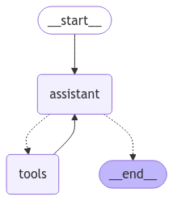

# ReAct agent

We will build a basic [ReAct agent](https://react-lm.github.io) with langgraph. The agent will have the ability to search the internet for supporting information and research for answering questions.

## 1. Define agent tools


```python
from langchain_community.tools.ddg_search.tool import DuckDuckGoSearchRun
from langchain_ollama import ChatOllama
```

Instantiate our DuckDuckGo search tool


```python
search_ddg = DuckDuckGoSearchRun()

tools = [search_ddg]
```

Test DuckDuckGo search tool by performing a web search and viewing the results


```python
rsp = search_ddg.invoke("what is a react agent?")
print(rsp)
```

    This tutorial explores how three powerful technologies — LangChain's ReAct Agents, the Qdrant Vector Database, and the Llama3 large language model (LLM) from the Groq endpoint — can work ... Other type of Agents: 3. ReAct Docstore: This agent employs the React technique to interact with a docstore. It requires both a Search tool and a Lookup tool, each having identical names. The ... ReAct agents represent a significant leap forward in the field of intelligent automation. By seamlessly integrating reasoning and action into a continuous, iterative process, these agents offer a ... A ReAct Agent (Reasoning and Acting Agent) is a framework that combines reasoning and acting to solve tasks by interacting with external tools or APIs, rather than simply responding with pre-trained knowledge. ReAct agents can break down a complex task into a series of steps, leveraging external resources like search engines, databases, or APIs ... To do so, let's introduce agents. ReAct Agent. In this tutorial, we will be using LangChain's implementation of the ReAct (Reason + Act) agent, first introduced in this paper. The key takeaway from the paper is that if we prompt the LLM to generate both reasoning traces and task-specific actions in a step-by-step manner, its performance on ...


Verify Ollama is running


```python
llm = ChatOllama(model='llama3.1')
llm.invoke("Hey there")
```


    AIMessage(content="How's it going? Is there something I can help you with or would you like to chat?", additional_kwargs={}, response_metadata={'model': 'llama3.1', 'created_at': '2024-11-20T21:14:40.03318781Z', 'message': {'role': 'assistant', 'content': ''}, 'done_reason': 'stop', 'done': True, 'total_duration': 1397243027, 'load_duration': 1144617735, 'prompt_eval_count': 12, 'prompt_eval_duration': 24033000, 'eval_count': 21, 'eval_duration': 225709000}, id='run-19b7383a-8c35-468a-a8a9-b1b7feefa01e-0', usage_metadata={'input_tokens': 12, 'output_tokens': 21, 'total_tokens': 33})


```python
POD_ID = "gv7ylhe0o1dohe"
llm = ChatOllama(model='llama3.1:70b', 
                temperature=0, 
                streaming=True, 
                base_url=f'https://{POD_ID}-11434.proxy.runpod.net/')
print(llm.invoke("Hey there").content)
```

    It's nice to meet you. Is there something I can help you with or would you like to chat?


Bind search tool to our LLM


```python
llm_with_tools = llm.bind_tools(tools)
```

## 2. Define graph


```python
from langgraph.graph import START, StateGraph, MessagesState
from langchain_core.messages import HumanMessage, SystemMessage
from langgraph.prebuilt import tools_condition, ToolNode
```

Define the system prompt to motivate the agent


```python
system_message = SystemMessage(content="""You are a helpful assistant tasked with performing 
                               web searches to find information relevant to user queries.""")

def assistant(state: MessagesState):
    return {
        "messages": [llm_with_tools.invoke([system_message] + state['messages'])]
    }
```

Build the graph


```python
graph = StateGraph(MessagesState)

# nodes
graph.add_node("assistant", assistant)
graph.add_node("tools", ToolNode(tools))

# edges
graph.add_edge(START, "assistant")
graph.add_conditional_edges(
    "assistant",
    tools_condition  # will route to "tools" or END
)
graph.add_edge("tools", "assistant")

app = graph.compile()
```

## 3. Visualize


```python
from IPython.display import Image, display

display(Image(app.get_graph(xray=True).draw_mermaid_png()))
```


    

    


# Test

## Llama3.1:7b results


```python
messages = [HumanMessage(content="What is a react agent?")]
messages = app.invoke({"messages": messages})
```


```python
for message in messages['messages']:
    message.pretty_print()
```

    ================================ Human Message =================================
    
    What is a react agent?
    ================================== Ai Message ==================================
    Tool Calls:
      duckduckgo_search (9455fa5a-5a47-4304-baa1-cdce42b6179d)
     Call ID: 9455fa5a-5a47-4304-baa1-cdce42b6179d
      Args:
        query: react agent
    ================================= Tool Message =================================
    Name: duckduckgo_search
    
    This tutorial explores how three powerful technologies — LangChain's ReAct Agents, the Qdrant Vector Database, and the Llama3 large language model (LLM) from the Groq endpoint — can work ... ReAct agents bring a new approach to AI by combining reasoning and action in a continuous cycle. As we learned previously, traditional AI systems separate decision-making from execution, whereas ... To do so, let's introduce agents. ReAct Agent. In this tutorial, we will be using LangChain's implementation of the ReAct (Reason + Act) agent, first introduced in this paper. The key takeaway from the paper is that if we prompt the LLM to generate both reasoning traces and task-specific actions in a step-by-step manner, its performance on ... ReAct agents begin by analyzing the task at hand. They decompose complex challenges into smaller, more manageable sub-tasks, enabling a detailed and thorough analysis. During this reasoning phase ... Learn how to build and benchmark ReAct agents, a type of LLM agent that can reason and act using tools, with LangChain. Compare the performance of different open-source LLMs, including Mixtral, GPT-3.5, and GPT-4.
    ================================== Ai Message ==================================
    
    A React agent is a type of artificial intelligence (AI) system that combines reasoning and action in a continuous cycle. It begins by analyzing the task at hand, decomposing complex challenges into smaller sub-tasks to enable thorough analysis. The React agent then generates both reasoning traces and task-specific actions in a step-by-step manner, allowing it to reason and act on a given problem. This approach is different from traditional AI systems that separate decision-making from execution.


## Llama3.1:70b results


```python
messages = [HumanMessage(content="What is a react agent?")]
messages = app.invoke({"messages": messages})
```


```python
for message in messages['messages']:
    message.pretty_print()
```

    ================================ Human Message =================================
    
    What is a react agent?
    ================================== Ai Message ==================================
    Tool Calls:
      duckduckgo_search (b57501c5-0297-4d52-936c-943a19ac543c)
     Call ID: b57501c5-0297-4d52-936c-943a19ac543c
      Args:
        query: react agent
    ================================= Tool Message =================================
    Name: duckduckgo_search
    
    This tutorial explores how three powerful technologies — LangChain's ReAct Agents, the Qdrant Vector Database, and the Llama3 large language model (LLM) from the Groq endpoint — can work ... ReAct agents bring a new approach to AI by combining reasoning and action in a continuous cycle. As we learned previously, traditional AI systems separate decision-making from execution, whereas ... To do so, let's introduce agents. ReAct Agent. In this tutorial, we will be using LangChain's implementation of the ReAct (Reason + Act) agent, first introduced in this paper. The key takeaway from the paper is that if we prompt the LLM to generate both reasoning traces and task-specific actions in a step-by-step manner, its performance on ... ReAct agents break down complex tasks into smaller steps, analyze each part, and then take action. This ensures more accurate and effective solutions and they continuously learn and adjust their ... Learn how to build and benchmark ReAct agents, a type of LLM agent that can reason and act using tools, with LangChain. Compare the performance of different open-source LLMs, including Mixtral, GPT-3.5, and GPT-4.
    ================================== Ai Message ==================================
    
    A React Agent is a type of artificial intelligence (AI) system that combines reasoning and action in a continuous cycle. It breaks down complex tasks into smaller steps, analyzes each part, and then takes action. This approach ensures more accurate and effective solutions, and the agent continuously learns and adjusts its behavior.

